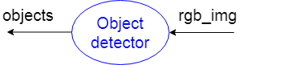
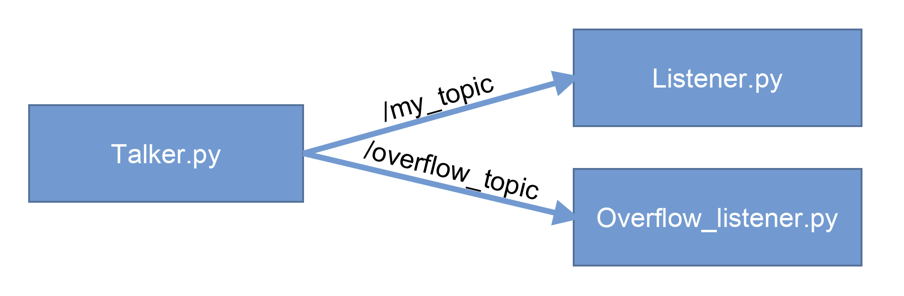
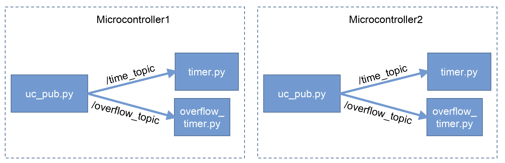

<!-- omit from toc -->
# Узлы, топики  и launch-файлы

## Содержание

- [ROS узлы и топики](#ros-узлы-и-топики)
    - [Основные инструменты](#основные-инструменты)
      - [rosnode](#rosnode)
      - [rostopic](#rostopic)
      - [rosmsg](#rosmsg)
    - [Добавим графику](#добавим-графику)
  - [Создание ROS Publisher с использованием rospy](#создание-ros-publisher-с-использованием-rospy)
  - [Создание ROS Subscriber с использованием rospy](#создание-ros-subscriber-с-использованием-rospy)
  - [ROS имена и пространства имен ну и еще мапирование](#ros-имена-и-пространства-имен-ну-и-еще-мапирование)
    - [Node name](#node-name)
    - [Node namespace](#node-namespace)
    - [Node remapping](#node-remapping)
    - [Что нужно сделать](#что-нужно-сделать)
- [Launch-файлы](#launch-файлы)
  - [Распространенные практики](#распространенные-практики)
    - [Объединение узлов под одним пространством имен](#объединение-узлов-под-одним-пространством-имен)
    - [Мапирование топиков](#мапирование-топиков)
    - [Подключение других launch-файлов](#подключение-других-launch-файлов)
    - [Создание опций для launch-файлов](#создание-опций-для-launch-файлов)
  - [ROS параметры](#ros-параметры)
  - [ROS Python параметры](#ros-python-параметры)
  - [Управление параметрами](#управление-параметрами)
    - [Сохранение и загрузка параметров](#сохранение-и-загрузка-параметров)
  - [Что нужно сделать?](#что-нужно-сделать-1)
  - [Вопросики](#вопросики)
  - [С чем познакомились?](#с-чем-познакомились)
  - [Полезные ресурсы](#полезные-ресурсы)


# ROS узлы и топики

Вот и подошел черед познакомиться с первыми базовыми вещами ROS - **узлами**. Под узлом подразумевается программа, которая производит некоторые действия. Узлы соединяются **топиками**, через которые передают **сообщения**. Таким образом, приходим к знакомой схемке типа графа.  

Для начала знакомства необходимо запомнить важную вещь! 

> :white_check_mark: В любой экосистеме ROS существует **мастер** (и он единственный), который работает с узлами. Фактически, он полностью организует их. 

<p align="center">

</p>

Начнем, чтобы что-то запустить, нужно воспользоваться утилитой запуска узла `rosrun`, которая имеет следующее описание:
`rosrun [pkg_name] [node_name] [additional args]`  
- pkg_name - имя пакета, в котором узел содержится  
- node_name - имя узла в пакете  
- additional args - дополнительные аргументы (рассматривается позже, в нашем случае используется явное задание имени узла в экосистеме ROS (`__name`) )

Let's Go, создаем простейшую систему с топиком и узлами:
- запуск ROS мастера, вся систем зиждется на нем и без него ничего не работает:
```bash
rosсore
```
- узел из пакета `rospy_tutorials` с именем `talker` командой:
```bash
rosrun rospy_tutorials talker
```
- узел из пакета `rospy_tutorials` с именем `listener` командой:
```bash
rosrun rospy_tutorials listener 
```

> :mechanical_arm: Запустите узлы утилиты. Не забывайте про то, что если узел при запуске работает бесконечно, то для запуска другого узла нужен новый терминал.

### Основные инструменты

#### rosnode

Открываем еще один терминал и начинаем анализ системы вместе с испытанием инструментов.

> :brain: Проверьте возможные команды утилиты `rosnode`

Посмотрим список узлов в системе с помощью:

```bash
rosnode list
```

Также можно посмотреть информацию о конкретном узле, например `/talker`:

```bash
rosnode info /talker
```
Команда нам выдаст следующее :point_down:	

```
--------------------------------------------------------------------------------
Node [/talker]
Publications: 
 * /chatter [std_msgs/String]
 * /rosout [rosgraph_msgs/Log]

Subscriptions: None

Services: 
 * /talker/get_loggers
 * /talker/set_logger_level


contacting node http://user-vb:39115/ ...
Pid: 8733
Connections:
 * topic: /chatter
    * to: /listener
    * direction: outbound
    * transport: TCPROS
 * topic: /rosout
    * to: /rosout
    * direction: outbound
    * transport: TCPROS

```

Сделаем небольшой анализ увиденного:
- Узел зовется `/talker`
- Публикует в два топика: `/chatter` и `/rosout`, второй - топик для логирования, в него автоматически публикуют все узлы, более конкретно рассмотрим потом
- Подписок нет
- Имеет два сервиса, которые тоже создаются автоматически у каждого узла, о сервисах потом
- PID (Porcess ID) = 8733 - это идентификатор процесса в системе Linux, нам он не важен
- Имеет соединения, они должны сходиться с названиями подписок и публикаций, таким образом сообщается, что все публикуется и подписывается корректно (соединения между узлами настроены)

> :brain: Попробуйте проанализировать информацию об узле `/listener`

#### rostopic

Теперь взглянем на возможности утилиты для анализа топиков

> :brain: Проверьте возможные команды утилиты `rostopic`

Посмотрим на список топиков в системе
```bash
rostopic list
```

Для вывода в более подробной форме воспользуемся опцией -v

```bash
rostopic list -v
```
```
Published topics:
 * /chatter [std_msgs/String] 1 publisher
 * /rosout [rosgraph_msgs/Log] 2 publishers
 * /rosout_agg [rosgraph_msgs/Log] 1 publisher

Subscribed topics:
 * /chatter [std_msgs/String] 1 subscriber
 * /rosout [rosgraph_msgs/Log] 1 subscriber
 ```

В выводе видна информация о подписках и публикациях топиков.

Взглянем на информацию о конкретном топике

```bash
rostopic info /chatter
```
```
Type: std_msgs/String

Publishers: 
 * /talker (http://user-vb:39115/)

Subscribers: 
 * /listener (http://user-vb:42123/)
```

По выводу можно определить, какие узлы подписаны на топик, а какие публикуют в него сообщения.

Далее можно показать сообщения, которые идут через этот топик. Для завершения нажмите Ctrl+C.

```bash
rostopic echo /chatter
```
```
data: "hello world 1536699023.89"
---
data: "hello world 1536699023.99"
---
...
```

> :brain: Найдите в справке утилиты `rostopic` аргумент измерения частоты публикации и измерьте частоту публикации в топик `/chatter`

#### rosmsg

Также существует утилита `rosmsg`, которая анализирует типы сообщений

> :brain: Проверьте возможные команды утилиты `rosmsg`

В информации о топике мы видели поле типа сообщений, которые идут через этот топик
```
Type: std_msgs/String
```
В типе можно видеть имя пакета типа `std_msgs` и само название `String`. Чтобы просмотреть, что содержит данный тип сообщения, воспользуемся командой

```bash
rosmsg show std_msgs/String
```
Результат:
```
string data
```
Как видно, данный тип сообщения содержит строковое поле `data`. Таким образом утилита анализирует информацию, связанную со строением (прототипом) сообщения, а не c самими данными в них.

А теперь посмотрим, какие есть сообщения в системе ROS 

```bash
rosmsg list
```
Так как их много, вывод не приводится :tired_face:	

Самый основной пакет сообщений - `std_msgs`, его типы можно глянуть командой, которая показывает типы сообщений, определенные в данном пакете

> :brain: Пройдите все представленные шаги, просмотрите типы сообщений `std_msgs/ColorRGBA`, `geometry_msgs/Pose2D`

### Добавим графику

Запустите графическое представление графа экосистемы с помощью утилиты `rqt_graph`. Вы увидите графический интерфейс, на котором отображены узлы и топик в нашей системе. Также можно управлять настройкой группы `Hide`, что позволяет скрывать некоторые элементы в соответствии с настройкой.

> :mechanical_arm:	Включите `rqt_graph` и в группе `Hide` снимите галочку с `Debug`. Убедитесь в том, что представлены все узлы и топики (даже с отладкой) системы, с помощью утилит `rosnode` и `rostopic`. Как видно, узел `/rosout` и топик `/rosout` создаются для отладки и соединяются со всеми узлами через топик `/rosout`.

> :mechanical_arm:	Запустите узел пакета `rospy_tutorials` с именем `listener`, но присвойте имя `__name:=listener2`. Проверьте с помощью `rqt_graph`, что оба `listener` подключилиь на общий топик.

> :mechanical_arm:	Запустите два узла из пакета `rospy_tutorials` с именем `talker` и присвойте им одинаковые имена `__name:=talker`. Убедитесь, что первый `talker` закрылся с сообщением о перехвате (`shutdown request: new node registered with same name`).


## Создание ROS Publisher с использованием rospy

Самое время познакомиться с возможностями написания узлов на языке Python.

Сначала взглянем на код, который будем разбирать:

```python
#!/usr/bin/env python3
import rospy
from std_msgs.msg import String

rospy.init_node('talker')
pub = rospy.Publisher('my_chat_topic', String, queue_size=10)
rate = rospy.Rate(1)

def start_talker():
    msg = String()
    while not rospy.is_shutdown():
        hello_str = "hi =) %s" % rospy.get_time()
        rospy.loginfo(hello_str)

        msg.data = hello_str
        pub.publish(msg)

        rate.sleep()

try:
    start_talker()
except (rospy.ROSInterruptException, KeyboardInterrupt):
    rospy.logerr('Exception catched')
```

А теперь пошел разбор. Для начала, импортируем основной модуль `rospy` и модуль сообщения типа `std_msgs/String`. 

```python
#!/usr/bin/env python3
import rospy
# Our case:     std_msgs/String     -> from std_msgs.msg import String
# Example:      geometry_msgs/Pose  -> from geometry_msgs.msg import Pose
from std_msgs.msg import String
``` 

После этого необходимо зарегистрировать узел в системе ROS, а также зарегистрировать топик на публикацию с указанием имени, типа сообщения для топика и размера очереди.
Первый аргумент функции `init_node()` задает название, которое будет зарегистрировано в рабочей экосистеме ROS.
Очередь нужна для сохранения сообщений, если узел публикует сообщения часто, при этом низкоуровневая передача сообщений работает медленнее или с задержками. При переполнении очереди отправляются наиболее актуальные данные.
```python
rospy.init_node('talker')
pub = rospy.Publisher('my_chat_topic', String, queue_size=10)
```

При регистрации узла функцией `init_node()` у конструктора есть флаг `anonymous` со значение по-умолчанию `False`. Так при включении этого флага
```python
rospy.init_node('talker', anonymous=True)
```
к указанному имени узла добавляется суффикс (получается, например, `talker_18231_12354`), который делает узел уникальным в системе (свойство **анонимности**).

У функции `rospy.Publisher()` есть флаг `latch` со значение по-умолчанию `False`. Его включение добавляет следующее поведение: при отправке сообщений в топик сохраняется последнее отправленное сообщение и когда кто-нибудь подписался на этот топик - он сразу получает последнее сообщение из этого топика, даже если отправка была раньше, чем узел подписался на топик. Помогает, если в топик один раз опубликовались данные, а другой узел подписался на этот топик намного позже.

После остается только создать объект `Rate`, который используется для выдерживания частоты выполнения кода. В конструктор передается значение частоты в Гц.

```python
rate = rospy.Rate(1) # 1 Hz
```

На этом подготовка и создание необходимых объектов для простейшего узла готовы и пора перейти к основной логике программы.

В API ROS есть функция, которая сообщает о том, что система ROS завершила работу, именно ей и воспользуемся в качестве условия выхода `rospy.is_shutdown()`. Далее определим функцию с основной логикой узла для дальнейшего запуска.

```python
def start_talker():
    # Создаем объект сообщения
    msg = String()
    # Бесконечный цикл, пока ROS система работает
    while not rospy.is_shutdown():
        # Сформируем сообщение, которое включает в себя время
        hello_str = "hi =) %s" % rospy.get_time()
        # Вывод в терминал информации (содержание сообщения)
        rospy.loginfo(hello_str)
        # Заполнение сообщения и публикация сообщения в топик
        msg.data = hello_str
        pub.publish(msg)
        # Сон в соответствии с выдерживаемой частотой
        rate.sleep()
```

После этого можем запустить функцию узла (в ней находится вся логика). При этом заворачиваем в конструкцию `try-catch`, чтобы обработать исключение (нажатием Стоп или Ctrl+C в терминале). 
```python
try:
    start_talker()
except (rospy.ROSInterruptException, KeyboardInterrupt):
    rospy.logerr('Exception catched')
```

> Задачка по самостоятельной интеграции скрипта в наш пакет:
- :mechanical_arm:	Внутри пакета создать папку `scripts` (Python файлы считаются скриптами), в ней создать файл talker.py и в нем разместить код узла.
- :mechanical_arm:	Далее дать права на выполение с помощью команды `chmod +x talker.py`. Необходимо, чтобы вы находились в одной папке со скриптом.
- :mechanical_arm:	Попробовать запустить в системе ROS созданный узел, для ранее созданного пакета команда будет следующей:  
`rosrun study_pkg talker.py`
- :brain:	Поскольку мы не задавали флаг анонимности в функции `rospy.init_node('talker')` (по-умолчанию там стоит `anonymous=False`), явно присваивать имя узла не требуется, оно будет такое, как было задано в функции `rospy.init_node()`
- :brain:	При возникновении каких-либо ошибок, они будут выведены в терминале 

## Создание ROS Subscriber с использованием rospy

А теперь перейдем к написанию узла подписки. 

Базовый код:
```python
#!/usr/bin/env python3
import rospy
from std_msgs.msg import String

def callback(msg):
    rospy.loginfo("I heard %s", msg.data)

rospy.init_node('listener')
rospy.Subscriber('my_chat_topic', String, callback, queue_size=10)
rospy.spin()
```

Для начала, импортируем основной модуль `rospy` и модуль сообщения типа `std_msgs/String`.
```python
import rospy
from std_msgs.msg import String
```

Далее пишем обработчик приема сообщений из топика, регистрируем узел и подписываемся на топик с указанием обработчика. Обработчик вызывается каждый раз, как узел получает сообщение.
```python
def callback(msg):
    rospy.loginfo("I heard %s", msg.data)

rospy.init_node('listener')
# Не требуется сохранять объект подписки, возврат функции игнорируется
rospy.Subscriber('my_chat_topic', String, callback, queue_size=10)
```

После остается лишь оставить узел работать до завершения системы ROS или прерывания узла (Ctrl+C). В момент регистрации подписки на топик узел уже готов принимать сообщения (прием происходит в отдельном потоке).  
С одной стороны можно использовать `rospy.is_shutdown()`. Такая практика рапространена, если необходимо еще что-то делать в узле помимо приема сообщений.  
Для простого приема сообщений можно вызвать `rospy.spin()`, который будет удерживать программу рабочей до тех пор, пока ROS не завершится или узел не бует прерван. 

```python
# В данном случае достаточно спина, по факту замена `while rospy.is_shutdown()`
rospy.spin()
```

> :mechanical_arm: Создайте также и скрипт `listener.py` в пакете. Запустите оба узла и убедитесь в работоспособности (один отправляет, другой получает сообщения).

## ROS имена и пространства имен ну и еще мапирование

Данная тема определяет важные аспекты, связанные с организацией системы при работе с узлами и топиками. 

### Node name

:white_check_mark: Для начала определим, что **имя узла** - это имя, которое присваивается узлу при его запуске. Для того, чтобы явно указать с каким именем запускать узел, используется аргумент `__name`, например:

```bash
rosrun rospy_tutorials listener __name:=listener
```

> ✅ Знак '`:=`' означает присваивание и будет далее часто использоваться при мапировании, установки значений:baby_chick:.


Установка имени была сделана специально, так как по-умолчанию данный узел создается **анонимным**(это свойство устанавливается в коде узла), что добавляет к его имени `listener` случайный численный суффикс. Именно поэтому мы явно и задали его имя.

> :mechanical_arm: Запустите узел `listener` из пакета `rospy_tutorials` без явного указания имени и посмотрите список активных узлов, обратите внимание на имя узла

> :mechanical_arm: Запустите узел `talker` из пакета `roscpp_tutorials` без явного задания имени и убедитесь в присутствии свойства анонимности. 

> :mechanical_arm: Запустите мастера, один узел `talker` из пакета `rospy_tutorials` с заданием имени и два узла `listener` из пакета `rospy_tutorials` без задания имени. Проверьте `rqt_graph` и убедитесь, что оба `listener` анонимные и подписались на топик `/chatter`

### Node namespace

:white_check_mark: **Пространство имен**- фактически, это префикс имени узла в системе. Концептуально, пространство имен объединяет несколько узлов по определенной задаче, расположению или другому признаку. Задавая пространство `new_ns` узлу `talker`, мы получаем узел в системе `/new_ns/talker` и топик `/new_ns/chatter`.

Задание пространства имен для узла производится аргументом `__ns`. Также можно задать глобальное простанство имен с помощью переменной окружения `ROS_NAMESPACE`. По-умолчанию глобальное пространство имен `/`.

> :mechanical_arm: Запустите узел `talker` с указание аргумента `__ns:=my_ns`. Обратите внимание на имена (префиксы) топиков и узлов.

> :mechanical_arm: (Выполнив предыдущее задание) Запустите узел `listener` без явного задания пространства имен. Убедитесь в том, что `listener` не получает сообщения (нет вывода в терминале). Разберитесь в проблеме, используя `rqt_graph`, `rostopic`, `rosnode`.

Получается, простанство имен может объединять узлы (и, как следствие, их топики).

### Node remapping

:white_check_mark: **Мапирование** - переназначение имени топика. Часто используется для соединения узлов, которые в названии топиков имеют общие имена.

Часто бывает так, что необходимо написать общий узел, в котором задаются имена топиков в общих форматах. Допустим, мы пишем узел-детектор объектов на изображении (RGB -> Found objects), он подписывается на топик `rgb_img`, по которому получает изображение. В топик `objects` он публикует обработанное изображение. Для лучшего представления:

<p align="center">

</p>

Названия топиков пишутся для наилучшего понимания работы узла и написания документации.

Далее используется драйвер камеры, который публикует в топик `image` изображение с камеры:  

<p align="center">

</p>

А теперь вопрос знатокам, как подключить эти два узла без переписывания кода? Ответ: мапирование топиков - запуск обработчика происходит следующим образом, вот примерчик мапирования топика `image` в `rgb_img`:

```bash
rosrun usb_cam usb_cam_node image:=rgb_img
```

> :mechanical_arm: Запустите узел `talker`, смапировав топик `chatter` в `chat_topic`. Запустите узел `listener`, также смапировав топик `chatter`. Оцените результат утилитой `rqt_graph`.

> :mechanical_arm: Запустите узлы `talker` и `listener`, при этом мапирование произведите только для узла `listener`. Убедитесь, что узлы не соединились через топик (не вывода в `listener`). Разберитесь в проблеме, используя `rqt_graph`, `rostopic`, `rosnode`.

Таким образом, разработчику достаточно назвать имена топиков, с которыми работает узел, в общей манере. Никакого специального названия. Далее при запуске человек может сам переименовать и соединить узлы топиками так, как ему удобно.

### Что нужно сделать

:open_file_folder: Не забудьте добавить ваше детище в репозиторий, который вы создавали на предыдущем занятии. Мы хотим, чтобы вы делали все в одном месте и не размножали ссылки.

> :mechanical_arm: Напишите узел, который публикует в топик четные числа (0, 2, 4, 6 и т.д.) с частотой 10 Гц. Имена скрипта, узла и топика выберите сами. Проверьте корректность частоты публикации.

> :mechanical_arm: На основании предыдщуей задачи дополните программу: при достижении числа 100 отправляйте сообщение в новый топик и сбрасывайте счетчик. Также необходимо создать новый узел с подпиской на этот топик, например overflow_listener.py.

<p align="center">

</p>

> :mechanical_arm: На основании предыдущей задачи дополните программу: Создайте два пространства имен для двух контроллеров. Переименуйте узлы и смапируйте топики при запуске. 

<p align="center">

</p>

# Launch-файлы

Помните, когда мы делали с вами прошлую  работу, вы сталкивались с тем, что каждый узел нужно запускать в разных терминалах? Но мы с вами запускали по 2-3 узла, а что будет, если нужно одновременно запустить больше таких? Ведь в реальных системах может присутствовать 10, 20 и более узлов, что может вызвать огромную боль при включении/выключении/проверке всех узлов. Звучит как-то не очень. 

Для облегчения жизни придумали специальный формат, основанный на формате `xml`. Суть данного формата в том, что он позволяет настраивать и запускать группы узлов. Это еще можно назвать скриптом запуска.

Для начала, попробуем рассмотреть простой launch-файл (так они называются, угадайте, как должна называться папка, в которой они хранятся). Смотрим 👇	

```xml
<launch>
    <node name="listener" pkg="rospy_tutorials" type="listener.py" output="screen"/>
    <node name="talker" pkg="rospy_tutorials" type="talker.py" output="screen"/>
</launch>
```

>❔ Раньше мы запускали узел `talker`, указывая `rosrun rospy_tutorials talker`. Когда мы пишем на Python, мы создаем скрипты `.py`. Так что оригинально при работе с Python запускаемые файлы будут с расширением `.py`. А в пакете `rospy_tutorials` разработчики просто скопировали файл `talker.py` в `talker`. Можете убедиться сами, у них размер одинаковый.
Основа launch-файла лежит в тэге `<launch>`, он оборачивает весь файл.

Далее вложенные тэги `<node>` задают запуск узлов. В качестве параметров тэгов указываются:

- `name` - имя, которое присваивается узлу в системе ROS (аналог `__name`)
- `pkg` - название пакета, внутри которого лежит узел
- `type` - название файла узла внутри пакета (для Pyhton - py-файлы, для C++ - исполняемые файл, там уж как назовете при компиляции)
- `output` - (необязательный) режим вывода информации, есть варианты `screen` (в консоль) и `log` (по-умолчанию, в лог-файл)

>❔ При запуске launch-файла также запускается мастер (roscore), если он не был запущен ранее.
Таким файлом из примера удобно пользоваться, так как вместо трех консолей потребуется единственная, в которую будет выкладываться вывод всех узлов, у которых `output="screen"`.

Кстати, такой файл уже есть в пакете `rospy_tutorials`, прочитать его можно командой:

```bash
roscat rospy_tutorials talker_listener.launch
```

Утилита для запуска называется `roslaunch` и вот пример запуска такого файла из пакета `rospy_tutorials`:

```bash
roslaunch rospy_tutorials talker_listener.launch
```

Выключение всех узлов из файла производится нажатием Ctrl+C в терминале, в котором запускали launch-файл. При этом система launch проверяет, что все узлы завершились.

>🦾	Напишите launch-файл `my_first.launch` с таким же содержанием и запустите его. Для этого нужно в пакете создать папку `launch` и в ней создать файл с расширением launch. Сделайте небольшую поправочку - измените имена узлов на `sender` и `receiver`. С помощью утилиты `roslaunch`  запустите файл из своего пакета `study_pkg` и убедитесь, что все работает.

## Распространенные практики

А теперь поговорим о наиболее применяемых практиках относительно launch-файлов.

### Объединение узлов под одним пространством имен

Допустим мы хотим запустить узлы в одном пространстве имен, так как они выполняют определенную задачу (являются подсистемой). Можно это сделать красиво с помощью тэга `<group>` и параметра `ns`:

```xml
<launch>
    <group ns="my_namespace">
        <node name="listener" pkg="rospy_tutorials" type="listener.py" output="screen"/>
        <node name="talker" pkg="rospy_tutorials" type="talker.py" output="screen"/>
    </group>
</launch>
```

>🦾	Объедините запускаемые узлы в файле `my_first.launch` в пространство `new_ns`

### Мапирование топиков

Часто неоходимо переименовать (мапировать) топики узлов. Делается это тэгами `<remap>` внутри тэга `<node>` и параметрами `from` и `to`:

```xml
<launch>
    <node name="listener" pkg="rospy_tutorials" type="listener.py" output="screen">
        <remap from="chatter" to="my_topic"/>
    </node>
    <node name="talker" pkg="rospy_tutorials" type="talker.py" output="screen">
        <remap from="chatter" to="my_topic"/>
    </node>
</launch>
```

>🦾	Смапируйте запускаемые узлы в файле `my_first.launch` к топику `new_topic`

### Подключение других launch-файлов

Иногда можно написать много простых launch-файлов и запустить все их с помощью одного launch-файла. Для этого существует тэг `<include>`:

```xml
<launch>
    <include file="$(find study_pkg)/launch/otherfile.launch" />
    <node name="listener" pkg="rospy_tutorials" type="listener.py" output="screen"/>
    <node name="talker" pkg="rospy_tutorials" type="talker.py" output="screen"/>
</launch>
```

Директива `(find study_pkg)` ищет пакет, имя которого передано аргументом (в нашем случае ищется путь до пакета `study_pkg`) и подставляет путь до него в случае удачного нахождения. Таким образом выполняется сначала launch-файл `otherfile.launch`, а затем остальное содержимое. Уровни вложенности launch-файлов не ограничены (насколько я знаю).

>🦾	Напишите launch-файл `another_one.launch` и добавьте его запуск в `my_first.launch` под пространством имен `new_ns`. Launch-файл `another_one.launch` должен запускать узел `listener` из пакета `roscpp_tutorials`, иметь имя `listener_cpp` и смапировать топик `chatter` к `new_topic`.

### Создание опций для launch-файлов

Иногда создание опреленной системы упрощается, если при запуске существует возможность передать опции файлу запуска. Для launch-файлов существует тэг `<arg>`, который добавляет аргументы launch-файлу:

```xml
<launch>
    <arg name="new_topic_name" default="new_chatter" />

    <node name="listener" pkg="rospy_tutorials" type="listener.py" output="screen">
        <remap from="chatter" to="$(arg new_topic_name)"/>
    </node>
    <node name="talker" pkg="rospy_tutorials" type="talker.py" output="screen">
        <remap from="chatter" to="$(arg new_topic_name)"/>
    </node>
</launch>
```

❔ Директива `(arg new_topic_name)` подставляет значение аргумента. При наличии параметра `default` в тэге `<arg>` установка параметра при запуске launch-файла не обязательна. Для задания значения аргумента выполнение roslaunch происходит следующим образом:

```bash
roslaunch rospy_tutorials talker_listener.launch new_topic_name:=my_topic
```

## ROS параметры

Есть еще один аспект, который называется сервер параметров.

✅ **Параметрами** в ROS называются просто данные, которые хранятся под определенными именами и пространствами имен. Как было рассмотрено ранее, запуск узла в пространстве имен меняет конечное имя узла, а также топика. Аналогично с этим, вся работа узла с параметрами (чтение, запись) происходит в том пространстве имен, которому он принадлежит.

> Сервер параметров хранит параметры и привязан к мастеру. Перезапуск мастера приводит к потере всех ранее заданных параметров.

Пора знакомиться с основной утилитой работы с параметрами =)

```bash
rosparam help
```
```
rosparam is a command-line tool for getting, setting, and deleting parameters from the ROS Parameter Server.

Commands:
    rosparam set    set parameter
    rosparam get    get parameter
    rosparam load   load parameters from file
    rosparam dump   dump parameters to file
    rosparam delete delete parameter
    rosparam list   list parameter names
```

Попробуем проверить список параметров в системе

```bash
rosparam list
```
```
/rosdistro
/roslaunch/uris/host_user_vb__35559
/rosversion
/run_id
```

Давайте поработаем с параметром /rosdistro

```bash
rosparam get /rosdistro
```
```
noetic
```
Удивительно, правда? 🙈

А теперь попробуем задать свой параметр и сразу прочитать его

```bash
rosparam set /my_param 'Hello =)'
rosparam set /my_set '{ 'P': 10.0, 'I': 1.0, 'D' : 0.1 }'

rosparam get /my_param
rosparam get /my_set
rosparam get /my_set/P
```
Результат:
```
Hello =)
{D: 0.1, I: 1.0, P: 10.0}
10.0
```

Вроде все логично 🐥 А теперь попробуйте перезапустить ячейку с выводом списка параметров в системе.

Как видно из вывода хелпа, параметрами также можно управлять, удаляя их, также выгружать в файл и загружать из файла.

## ROS Python параметры

Теперь рассмотрим применение параметров внутри узлов.
Дальнейшие примеры можно производить, вызвав в терминале команду `python`, тогда у вас откроется консоль Python и вводить туда по очереди. Или можно написать все в один скрипт с выводом с помощью `print()` или `rospy.loginfo()`. 

Для начала стандартный и знакомый для Python узла код:

```python
import rospy
rospy.init_node('params_study')
```

Ну и начнем рассматривать, что же можно сделать с параметрами в `rospy`? 

Рассмотрим основные типы обращений к параметрам:

```python
distro = rospy.get_param('/rosdistro')
```
Обращение глобально - как видно, в начале стоит `/`. Не обращаем внимания на ns, ищем именно такой путь параметра и никак иначе!

```python
my_set_param = rospy.get_param('my_set')
```
Обращение локально - в начале не стоит `/`. Допустим мы запустили узел, указав `ns:=my_ns`. Тогда вызов данной функции будет пытаться найти парметр по пути - `/my_ns/my_set` 

```python
my_private_param = rospy.get_param('~private_param')
```
Обращение приватно, поиск будет по пути `/params_study/private_param`. Если задат ns - он будет добавлен перед именем узла. Например, `ns:=my_ns -> /my_ns/params_study/private_param`

Теперь на примере, можно установить разные типы параметров и посмотреть, как они будут формироваться. Зададим параметры из узла, локальный, глобальный и приватный. Первый агрумент - название параметра, второй - значение:

```python
rospy.set_param('~ros_priv_param', 'Hi, I am private =)')
rospy.set_param('ros_loc_param', 'Hi, I am local =)')
rospy.set_param('/ros_glob_param', 'Hi, I am global =)')
```

Выведем список после задания параметров (для примера было задано дополнительный ns - `sample_ns`):

```bash
rosparam list
```
И получаем:

```
/sample_ns/params_study/ros_priv_param
/sample_ns/ros_loc_param
/ros_glob_param
```

Все получилось!

> ❔Глобальный не имеет префикса ns. Приватный отличается тем, что в его префиксе присутствует имя узла. Значит он относится конкретно к узлу. Соответственно, можно запустить много одинаковых узлов (например с помощью флага анонимности) и получить такое же количество параметров.

>🦾 А теперь с помощью утилиты `rosparam` проверьте значения заданных параметров `ros_priv_param`, `ros_glob_param`, `ros_loc_param`

Значит так, мы научились получать параметры от сервера параметров, задавать (если их не существовало - создавать, функция все равно одна и та же). Еще один момент. Бывает такое, хотим работать с параметром, а его нету в сервере (причины могут быть разные). В этом случае при запросе происходит это:

```python
not_exist_param = rospy.get_param('i_do_not_exist')
```
И сейчас вы увидите огромную ошибку, которую пугаться не стоит 👹

```
Traceback (most recent call last):
  File "<stdin>", line 1, in <module>
  File "/opt/ros/melodic/lib/python2.7/dist-packages/rospy/client.py", line 465, in get_param
    return _param_server[param_name] #MasterProxy does all the magic for us
  File "/opt/ros/melodic/lib/python2.7/dist-packages/rospy/msproxy.py", line 123, in __getitem__
    raise KeyError(key)
KeyError: 'i_do_not_exist'
```

В общем, решение этой проблемы достаточно простое: для начала решим вопрос по пути Python - ловим все исключения (ошибки) и после обрабатываем:

```python
try:
    not_exist_param = rospy.get_param('i_do_not_exist')
except:
    not_exist_param = 'Okay, now it`s default time =0'
```

А еще можно задать значение по умолчанию прямо в вызов вторым аргументом:

```python
not_exist_param = rospy.get_param('i_do_not_exist', 'default_value')
```

И все работает (ура)!

Теперь мы умеем и обрабатывать получение значения по-умолчанию. Есть еще функционал из туториала, удаление параметра, проверка существования параметра и получение списка. Зачем это может понадобиться решайте сами.

```python
# Мы этот параметр ставили ранее
param_name_2_delete = '/ros_glob_param'

# Проверим список параметров, только уже через Python
param_list = rospy.get_param_names()
rospy.loginfo(param_list)

# Наличие можно проверить через функционал ROS    
if rospy.has_param(param_name_2_delete):
    rospy.loginfo('[ROSWay] Parameter exist')
else:
    rospy.loginfo('[ROSWay] Parameter not exist')
    
# И с проверкой удаляем его
if rospy.has_param(param_name_2_delete):
    rospy.delete_param(param_name_2_delete)
    
# Еще раз проверим:
if rospy.has_param(param_name_2_delete):
    rospy.loginfo('[ROSWay] Parameter exist')
else:
    rospy.loginfo('[ROSWay] Parameter not exist')
```

Если вывод похож на:
```
[ROSWay] Parameter exist
[ROSWay] Parameter not exist
```
Значит вы справились с этой проблемой и большие молодцы!

## Управление параметрами

Сейчас хочется обратить внимание на приватные параметры с точки зрения практики. Обычно узлы стартуют с помощью launch-файлов, поэтому задаются параметры внутри с помощью тэгов `<param>`. Пример из одного из файлов планера:

```xml
    <param name="base_global_planner" value="global_planner/GlobalPlanner" />
    <param name="planner_frequency" value="1.0" />
    <param name="planner_patience" value="5.0" />
```
Таким образом задаются локальные параметры (с учетом ns).

Еще немного для понимания, пример из драйвера камеры (внутри тэга `<node>` параметры задаются приватными!):

```xml
<node ns="stereo" name="left_camera" pkg="usb_cam" type="usb_cam_node" output="screen" >
    <param name="video_device" value="/dev/video0" />
	<param name="image_width" value="640" />
	<param name="image_height" value="480" />
</node>
```

Здесь с помощью параметров задается путь девайса (конкретный, так как таких может быть много) и размеры выходного изображения.

### Сохранение и загрузка параметров

Так как при закрытии мастера параметры теряются, было бы неплохо узнать, а как сохранять параметры в файл? А как загружать из файла? Такой функционал есть и утилита все та же:

Сохраним все параметры в файл `/tmp/my_dump.yaml` (обычно расширение `.yaml`) начиная с пространства имен `/` - то есть все параметры. Флаг `-v` для визуального контроля:

```bash
rosparam dump -v '/tmp/my_dump.yaml' '/'
```

Теперь загрузим параметры из файла `/tmp/my_dump.yaml`, но в новое пространство имен:

```bash
rosparam load -v '/tmp/my_dump.yaml' '/my_new_ns_just_to_make_it_long_for_control'
```
Выведем список параметров командой:

```bash
rosparam list
```
Наши параметры будут следующие:

```
/my_new_ns_just_to_make_it_long_for_control/ros_glob_param
/my_new_ns_just_to_make_it_long_for_control/rosdistro
/my_new_ns_just_to_make_it_long_for_control/roslaunch/uris/host_user_vb__38669
/my_new_ns_just_to_make_it_long_for_control/rosversion
/my_new_ns_just_to_make_it_long_for_control/run_id
/my_new_ns_just_to_make_it_long_for_control/sample_ns/params_study/ros_priv_param
/my_new_ns_just_to_make_it_long_for_control/sample_ns/ros_loc_param
/ros_glob_param
/rosdistro
/roslaunch/uris/host_user_vb__38669
/rosversion
/run_id
/sample_ns/params_study/ros_priv_param
/sample_ns/ros_loc_param
```

Как видим, у нас появилась полная копия параметров, только в новом пространстве имен. Еще немного практики для понимания пространства имен

Сохраним параметры тольько из `sample_ns`

```bash
rosparam dump -v '/tmp/my_dump_special_ns.yaml' '/sample_ns'
```
Загрузим их в новое пространство:

```bash
rosparam load -v '/tmp/my_dump_special_ns.yaml' '/new_ns_for_special'
```
Посмотрим список наших параметров командой:

```bash
rosparam list
```
И вывод нам даст соответственно следующее:

```
/my_new_ns_just_to_make_it_long_for_control/ros_glob_param
/my_new_ns_just_to_make_it_long_for_control/rosdistro
/my_new_ns_just_to_make_it_long_for_control/roslaunch/uris/host_user_vb__38669
/my_new_ns_just_to_make_it_long_for_control/rosversion
/my_new_ns_just_to_make_it_long_for_control/run_id
/my_new_ns_just_to_make_it_long_for_control/sample_ns/params_study/ros_priv_param
/my_new_ns_just_to_make_it_long_for_control/sample_ns/ros_loc_param
/new_ns_for_special/params_study/ros_priv_param
/new_ns_for_special/ros_loc_param
/ros_glob_param
/rosdistro
/roslaunch/uris/host_user_vb__38669
/rosversion
/run_id
/sample_ns/params_study/ros_priv_param
/sample_ns/ros_loc_param
```

> 🧠 А теперь мозговой штурм! На этом моменте можно очень хорошо понять принцип пространства имен:
На это можно смотреть как на систему папок. Если мы указываем для сохранения конкретное пространство, то все, что лежит внутри ns (далее за `/` этой папки) будет сохранено. При загрузке, мы указываем папку, с которой начать запись. 

Думаем, объяснять функционал `delete` сильно не стоит, поэтому сносим целое пространство и смотрим, что получилось:

```bash
rosparam delete -v '/my_new_ns_just_to_make_it_long_for_control'
```

Далее уже известная нам команда:

```bash
rosparam list
```

```
/new_ns_for_special/params_study/ros_priv_param
/new_ns_for_special/ros_loc_param
/ros_glob_param
/rosdistro
/roslaunch/uris/host_user_vb__38669
/rosversion
/run_id
/sample_ns/params_study/ros_priv_param
/sample_ns/ros_loc_param
```

В итоге мы подчистили наш сервер параметров.

Теперь к практическим навыкам - вспомним, что запуск launch-файла запускает также и мастера, если тот ранее не был запущен. А сервер параметров завязан на мастера. Значит может понадобиться функционал загрузки параметров на момент запуска узлов:

```xml
<rosparam file="config/costmap_common.yaml" command="load" ns="global_costmap" />
```

В этом примере показан тэг `<rosparam>` и его параметры. На самом деле, параметры схожи с опциями утилиты:

- `file` - файл с сохраненными/подгружаемыми параметрами;
- `command` - может быть `[load / dump / delete]`;
- `ns` - пространство имен, куда загрузить / откуда сохранить / что удалить.

> ❔ Формат `<имя параметра> : <значение>` - это специальный формат файлов `YAML`. Для массивов и вложенных параметров происходит обертка вложенности скобками `{}` или просто новой строкой и внутри по идентичному принципу.

```yaml
ros_glob_param: Hi, I am global =)
rosdistro: 'melodic'
roslaunch:
  uris: {host_user_vb__38669: 'http://user-vb:38669/'}
run_id: 1b078410-b789-11e8-91b9-0800278832b1
sample_ns:
  params_study: {ros_priv_param: 'Hi, I am private =)'}
  ros_loc_param: Hi, I am local =)
```

## Что нужно сделать?

Помимо заданий в самом топике, нужно сделать следующее:

>🦾	Мы с вами разобрали launch-файлы и то, как с ними работать. Вот еще одно задание по ним: добавьте аргумент, чтобы можно было задавать новое имя топика в момент запуска launch-файла. Подсказка, как пробросить аргумент через тэг `<include>` есть в полезных ссылках. Таким образом, задаваемое имя топика должно учитываться как в файле `my_first.launch`, так и в файле `another_one.launch`.

> 🦾 Задачка посложнее. Схема прикреплена к задаче:
> - Есть три программы, две из них (Polynominal и Summing) должны запускаться вместе и жить постоянно, обрабатывая запросы.
> - Одна запускается как программа единичного запроса (Request).
> - При запуске Request передается три числа, они через топик идут в узел полинома, там возводятся в степень в зависимости от положения, далее через топик в Summing, возвращается и отдается обратно как ответ.
> 
> <p align="center">
> 
> </p>

## Вопросики

- В чем предназначение `launch` файлов? В чем их главные преимущества?
- Внимание! большой вопрос. Расшифруйте то, что происходит в этом launch-файле

```xml
<launch>
  <arg name="model" default="waffle" doc="model type [burger, waffle, waffle_pi]"/>
  <arg name="x_pos" default="-2.0"/>
  <arg name="y_pos" default="-0.5"/>
  <arg name="z_pos" default="0.0"/>
  
  <param name="model" value="$(arg model)"/>

  <arg name="gz_gui" default="false"/>

  <include file="$(find gazebo_ros)/launch/empty_world.launch">
    <arg name="world_name" value="$(find turtlebot3_gazebo)/worlds/turtlebot3_world.world"/>
    <arg name="paused" value="false"/>
    <arg name="use_sim_time" value="true"/>
    <arg name="gui" value="$(arg gz_gui)"/>
    <arg name="headless" value="false"/>
    <arg name="debug" value="false"/>
  </include>

  <param name="robot_description" command="$(find xacro)/xacro --inorder $(find turtlebot3_description)/urdf/turtlebot3_$(arg model).urdf.xacro" />

  <node pkg="gazebo_ros" type="spawn_model" name="spawn_urdf"  args="-urdf -model turtlebot3_$(arg model) -x $(arg x_pos) -y $(arg y_pos) -z $(arg z_pos) -param robot_description" />

  <node pkg="robot_state_publisher" type="robot_state_publisher" name="robot_state_publisher">
    <param name="publish_frequency" type="double" value="50.0" />
  </node>
</launch>
```

## С чем познакомились?

- Мы научились таким аспектам организации, как имена узлов, пространства имен и мапирование топиков.
- Все рассмотренные вещи будут активно использоваться для корректной организации экосистемы на машине или в сети.
- Такие приемы позволяют писать узлы в общем виде. Далее один и тот же узел может использоваться для разных задач, при этом как названия самих узлов в системе, так и названия топиков могут быть настроены под конкретную систему.
- Разобрались с утилитой `roslaunch` и рассмотрели ряд тэгов, используемых в формате `XML`.
- Мы познакомились с сервером параметров и утилитой работы с параметрами и научились пользовать параметры в Python
- Рассмотрели практические применения утилит и параметров в `roslaunch`, в том числе познакомились с утилитой `rosparam`

## Полезные ресурсы

- [XML](http://wiki.ros.org/roslaunch/XML)
- [Сервер параметров](http://wiki.ros.org/Parameter%20Server)
- [Cтраница из туториала про параметры](http://wiki.ros.org/rospy_tutorials/Tutorials/Parameters)
- [API rospy](http://docs.ros.org/api/rospy/html/)
- [Полезная ссылка](http://wiki.ros.org/roslaunch/XML/include)