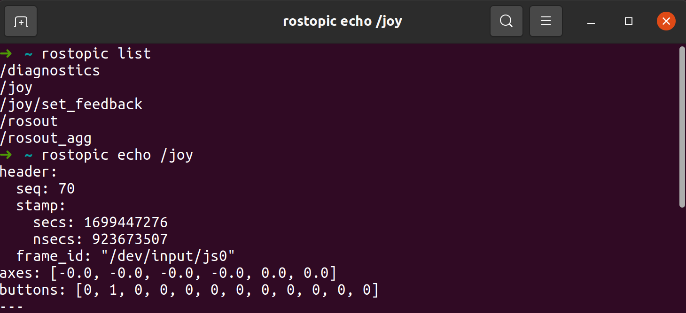

## Время двигаться!

```bash
TURTLEBOT3_MODEL=waffle roslaunch turtlebot3_gazebo turtlebot3_world.launch
```

```bash
TURTLEBOT3_MODEL=waffle roslaunch turtlebot3_teleop turtlebot3_teleop_key.launch
```

<p align="center">

</p>

<p align="center">

</p>

Беспроводный геймпад Logitech F710 – это универсальный и популярный геймпад, предназначенный для использования как с ПК, так и с устройствами на платформе Android. Он предлагает беспроводное подключение и ряд функций.

<p align="center">

</p>

**Таблица индексных номеров /joy.buttons**

| Индекс | Название кнопки на фактическом контроллере |
| ------ | ------------------------------------------- |
| 0      | X                                           |
| 1      | A                                           |
| 2      | B                                           |
| 3      | Y                                           |
| 4      | LB                                          |
| 5      | RB                                          |
| 6      | LT                                          |
| 7      | RT                                          |
| 8      | Back                                       |
| 9      | Start                                      |
| 10     | Кнопка стика слева                        |
| 11     | Кнопка стика справа                       |

**Таблица индексов осей /joy.axes:**

| Индекс | Название оси на фактическом контроллере |
| ------ | ----------------------------------------- |
| 0      | Ось влево/вправо стика слева             |
| 1      | Ось вверх/вниз стика слева               |
| 2      | Ось влево/вправо стика справа            |
| 3      | Ось вверх/вниз стика справа              |
| 4      | Крестовина влево/вправо                  |
| 5      | Крестовина вверх/вниз                   |

Перейдем к запуску нашего джойстика. Давайте создадим launch файл, к примеру, ```my_joy_launch.launch```, для этого внутри нашего пакета создадим папку  ```robot_software```, а в ней папку ```launch```, а там ```drivers```

```xml
<launch>
    <node name="joy_node" pkg="joy" type="joy_node" output="screen">
        <param name="dev" value="/dev/input/js0" />
    </node>
</launch>
```
Запустим его:

```bash
roslaunch [package_name] my_joy_launch.launch
```

<p align="center">

</p>

Теперь перейдем к управлению роботом! Для этого помимо драйвера нужно запустить файл отправки команд на робота. Для этого создайте в своём пакете папку config и добавьте туда файл joy.config.yaml со следующим содержанием:

```yaml
axis_linear: 1  # Left thumb stick vertical
scale_linear: 0.7
scale_linear_turbo: 1.5

axis_angular: 0  # Left thumb stick horizontal
scale_angular: 0.4

enable_button: 2  # Left trigger button
enable_turbo_button: 5  # Right trigger button
```

 Модернизируем предыдущий лаунч следующим способом: 

```xml
<launch>
  <arg name="joy_dev" default="/dev/input/js0" />
  <arg name="config_filepath" default="$(find [package_name])/config/joy.config.yaml" />
  
  <node pkg="joy" type="joy_node" name="joy_node">
    <param name="dev" value="$(arg joy_dev)" />
    <param name="deadzone" value="0.3" />
    <param name="autorepeat_rate" value="20" />
  </node>

  <node pkg="teleop_twist_joy" name="teleop_twist_joy" type="teleop_node">
    <rosparam command="load" file="$(arg config_filepath)" />
  </node>
</launch>
```
Запустим робота и управление с джойстика
```bash
TURTLEBOT3_MODEL=waffle roslaunch turtlebot3_gazebo turtlebot3_world.launch
```

```bash
roslaunch [package_name] my_joy_launch.launch
```
Для движения нашего робота нужно держать кнопку `X` или если мы хотим прокатиться в турбо режиме - `RB`

<p align="center">

</p>

Задание:
- Измените конфиг так, чтобы робот начал двигаться быстрее.
- Посмотрите в каком формате присылает данные узел `teleop_twist_joy`. За что отвечает каждое поле?
