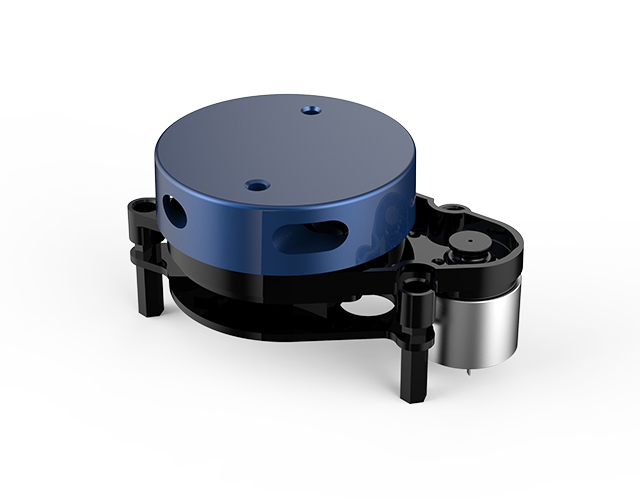
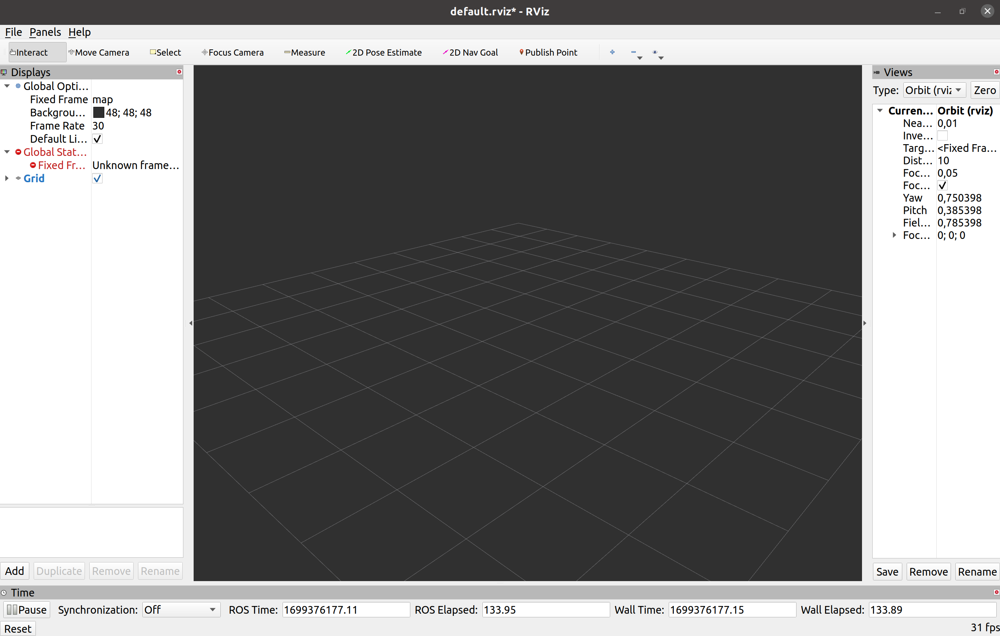
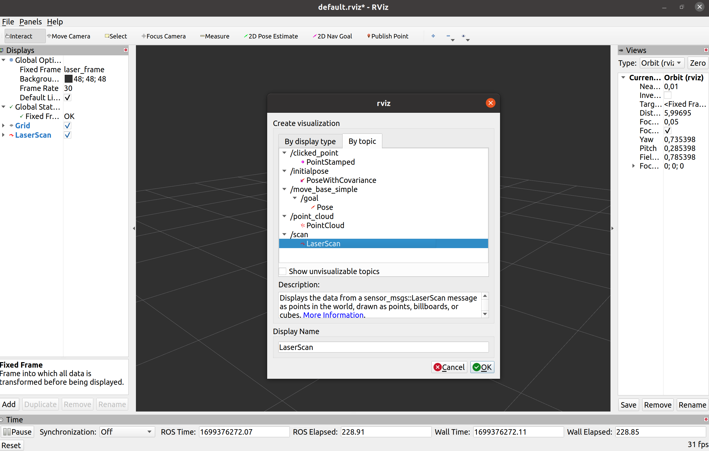
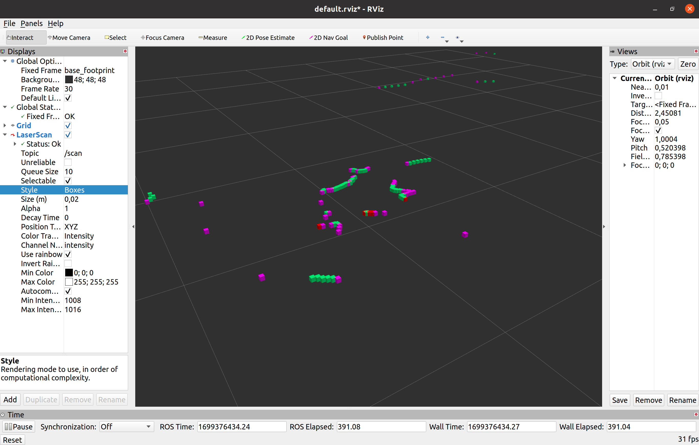
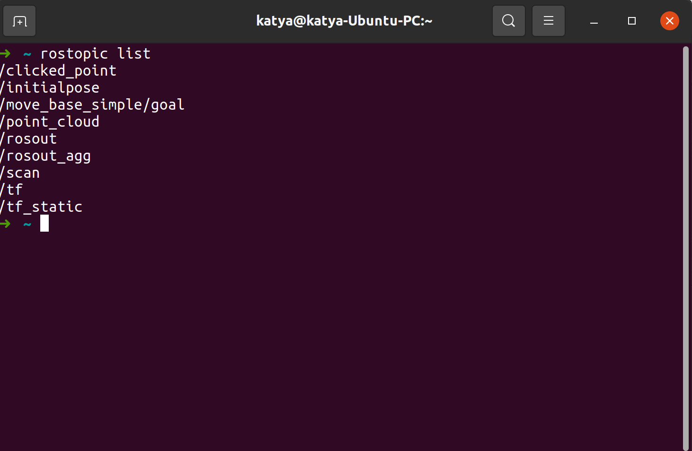
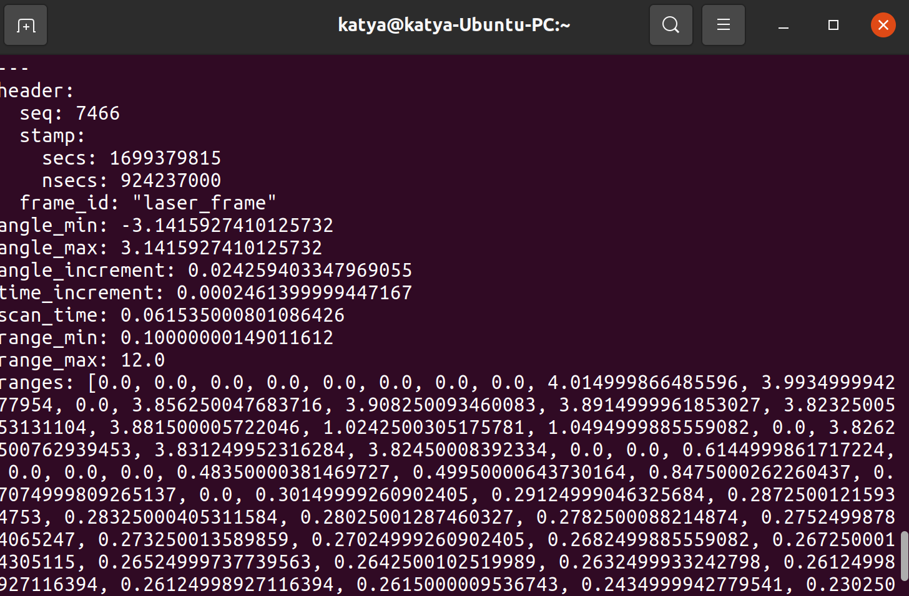

## YDLidar X2

В наших с вами задачах мы будем использовать небольшой лидар, представленный на картинке ниже:

<p align="center">

</p>


Lidar YDLidar X2 - это лидар с 2D-сканированием, основанный на принципе тени.

Основные характеристики Lidar YDLidar X2:

- Максимальное угловое разрешение: 1200 (одинарный зрачок), - 600 (двойной зрачок) градусов
- Максимальное угловое поле зрения: 270 градусов
- Максимальное расстояние обнаружения: 20 метров
- Скорость обмена данными: 8000-10000 бит/с
- Диапазон рабочих температур: -10

Для работы с датчиком Lidar YDLidar X2 необходимо установить пакеты:

- ```YDLidar-SDK library```
- ```ydlidar_ros_driver```

Вообще, вся установка - код, который вы можете запустить из любого места у вас описана уже в ```00_installation.md```, воспользовавшись командой вы и все и установите:

 ```bash
 sudo sh [CODE_NAME]
 ```

Поехали дальше. На [страничке Github нашего лидара](https://github.com/YDLIDAR/ydlidar_ros_driver) мы можем найти информацию о том, что лидар публикует, какой тестовый launch файл мы можем запустить, ну и он сам - давайте на него взглянем:

```xml
<launch>

  <arg name="tf" default="true" />
  <node name="ydlidar_lidar_publisher"  pkg="ydlidar_ros_driver"  type="ydlidar_ros_driver_node" output="screen" respawn="false" >
    <!-- string property -->
    <param name="port"         type="string" value="/dev/ydlidar"/>  
    <param name="frame_id"     type="string" value="laser_frame"/>
    <param name="ignore_array"     type="string" value=""/>

    <!-- int property -->
    <param name="baudrate"         type="int" value="115200"/>  
    <!-- 0:TYPE_TOF, 1:TYPE_TRIANGLE, 2:TYPE_TOF_NET -->
    <param name="lidar_type"       type="int" value="1"/>  
    <!-- 0:YDLIDAR_TYPE_SERIAL, 1:YDLIDAR_TYPE_TCP -->
    <param name="device_type"         type="int" value="0"/>  
    <param name="sample_rate"         type="int" value="3"/>  
    <param name="abnormal_check_count"         type="int" value="4"/>  

    <!-- bool property -->
    <param name="resolution_fixed"    type="bool"   value="true"/>
    <param name="auto_reconnect"    type="bool"   value="true"/>
    <param name="reversion"    type="bool"   value="false"/>
    <param name="inverted"    type="bool"   value="true"/>
    <param name="isSingleChannel"    type="bool"   value="true"/>
    <param name="intensity"    type="bool"   value="false"/>
    <param name="support_motor_dtr"    type="bool"   value="false"/>
    <param name="invalid_range_is_inf"    type="bool"   value="false"/>
    <param name="point_cloud_preservative"    type="bool"   value="false"/>

    <!-- float property -->
    <param name="angle_min"    type="double" value="-180" />
    <param name="angle_max"    type="double" value="180" />
    <param name="range_min"    type="double" value="0.1" />
    <param name="range_max"    type="double" value="12.0" />
    <!-- frequency is invalid, External PWM control speed -->
    <param name="frequency"    type="double" value="10.0"/>
  </node>
  
  <group if="$(arg tf)">
      <node pkg="tf" type="static_transform_publisher" name="base_link_to_laser4"
    args="0.0 0.0 0.2 0.0 0.0 0.0 /base_footprint /laser_frame 40" />
  </group>

</launch>
```

Давайте внутри нашего пакета создадим папку  ```kitty_vision```, а в ней папку ```launch```, а там ```drivers``` и скопируем туда этот launch, например, под названием ```start_ydlidar_x2.launch```.  

Помните, когда мы с вами проходили первый урок, мы уже познакомились с ```rviz```? Давайте теперь его запустим в другом терминале командой 

```
rviz
```

У нас открылось окно, но никакой информации из него мы пока получить не можем.

<p align="center">

</p>

Следовательно, его нужно настроить, а для этого `Add->By topic->/scan->LaserScan` и `Fixed Frame` меняем на `base_footprint`:

<p align="center">

</p>

Отлично! Теперь мы видим, что данные с лидара к нам приходят. Можно еще поменять отображение точек, например изменить их стиль `Style` или размер `Size (m)`. Настройте, как вам будет удобнее и поехали дальше. 

<p align="center">

</p>

На самом деле, расскажем вам по секрету не всегда обязательно открывать второй терминал для запуска ```rviz```, а для этого можно воспользоваться строчкой:

```
<node name="rviz" pkg="rviz" type="rviz" args="-d /path/to/your/rvizconfigfile"/>
```

Обратите внимание, что ```"path/to/your/rvizconfigfile" ``` это путь к конфигу rviz, который вы должны создать. Если у вас пока нет такого файла, то уберите ```args```, как аргумент. Но давайте все равно разберемся, как нам сохранить конфигурационный файл. 


После того, как вы все настроили, сохраняем наш конфиг в папку ```rviz``` внутри ```kitty_vision```. Для этого нужно ее заранее создать и выполнить `Ctrl+Shift+s`. Названия желательно делать понятные каждому, поэтому предлагаем оставить такое: `start_ydlidar.rviz`

Отлично! С этим мы справились.

>🦾	Теперь предлагаем создать ```launch``` файл, который будет запускать у нас и драйвер для лидара и ```rviz```. Попробуйте это сделать самостоятельно, а потом загляните в решение. Ваше решение поместите в папку ```kitty_vision->launch->full->full_start_lidar.launch```

<details>
<summary>
👾👾👾 Внимание ответ!
</summary>

```xml
<launch>
 <!-- Start ydlidar -->
 <include file="$(find kitty_package)kitty_vision/launch/drivers/start_ydlidar_x2.launch" />

 <!-- Start rviz -->
 <node name="rviz" pkg="rviz" type="rviz" args="-d /path/to/your/rvizconfigfile"/>
</launch>
```

</details>


>🦾 Для закрепления создайте опцию для вашего ```full_start_lidar.launch```, в котором ```rviz``` будет запускаться только в том случае, если `<arg>` принимает значение `True`. В таком случае ваш `launch` с лидаром будет запускаться, как:

```bash
roslaunch kitty_package full_start_lidar.launch rviz:=True
```

или

```bash
roslaunch kitty_package full_start_lidar.launch rviz:=False
```
<p align="center">

</p>

<p align="center">

</p>

## Kitty Gmapping!

Настало время сделать систему построения карты не только в симуляторе, но и на нашем роботе. Для этого нужно сделать подготовку.
Сейчас вам нужно в папку конфиг поместить `config` для `gmapping`, который обзовем, как `slam_gmapping.yaml`

```yaml
inverted_laser: false
throttle_scans: 1
base_frame: base_footprint
map_frame: map
odom_frame: odom
map_update_interval: 1.0
maxUrange: 9.0
sigma: 0.05
kernelSize: 1
lstep: 0.05
astep: 0.05
iterations: 5
lsigma: 0.075
ogain: 3.0
lskip: 0
minimumScore: 200.0
srr: 0.1
srt: 0.2
str: 0.1
stt: 0.2
linearUpdate: 0.1
angularUpdate: 0.2
temporalUpdate: -1.0
resampleThreshold: 0.5
particles: 80
xmin: -10.0
ymin: -10.0
xmax: 10.0
ymax: 10.0
delta: 0.1
llsamplerange: 0.01
llsamplestep: 0.01
lasamplerange: 0.005
lasamplestep: 0.005
transform_publish_period: 0.05
occ_thresh: 0.25
maxRange: 11.0
```

Далее в `kitty_software->drivers` под названием `slam_gmapping.launch` создаем файл для запуска построения карты.

```xml
<?xml version="1.0"?>
<launch>
    <arg name="scan_input_topic" default="scan" />
    <node name="slam_gmapping" pkg="gmapping" type="slam_gmapping" output="screen">
        <rosparam file="$(find kitty_pkg)/config/slam_gmapping.yaml" command="load"/>
        <remap from="scan" to="$(arg scan_input_topic)"/>
    </node>
</launch>
```
В `kitty_software->drivers` под названием `tf_transforms.launch` создаем файл для для публикации преобразований координат между различными системами координат (т.е. осями отсчета) робота, в нашем случае для камеры и лидара.

```xml
<?xml version="1.0" encoding="UTF-8"?>
<launch>

    <!-- main body -->
    <node pkg="tf2_ros" type="static_transform_publisher"
        name="base_footprint_2_base_link"
        args="
            0.0 0.0 0.109
            0.0 0.0 0.0
            /base_footprint /base_link" />

    <!-- sensors -->
    <!-- lidar -->
    <node pkg="tf2_ros" type="static_transform_publisher"
        name="base_link_2_bottom_ydlidar_scan_link"
        args="
            0.0 0.0 -0.009
            0.0 0.0 0.0
            /base_link /bottom_ydlidar_scan_link" />
    <node pkg="tf2_ros" type="static_transform_publisher"
        name="base_link_2_front_rs_d435i_camera_link"
        args="
            -0.045 0.0 0.29
            0.0 0.226893.0 0.0
            /base_link /front_rs_d435i_camera_link" />

</launch>
```

Осталось совсем немного! Когда мы изучали одометрию, мы создали файл, объединяющий визуальную одометрию и запуск нашей камеры. 

>🦾	Объедините лаунчи `full_rs_odom.launch`, `tf_transforms.launch` и `slam_gmapping.launch` в один и проверьте, что все корректно запускается. Новый файл поместите в `kitty_software->full` и назовите его, как `full_gmapping.launch`