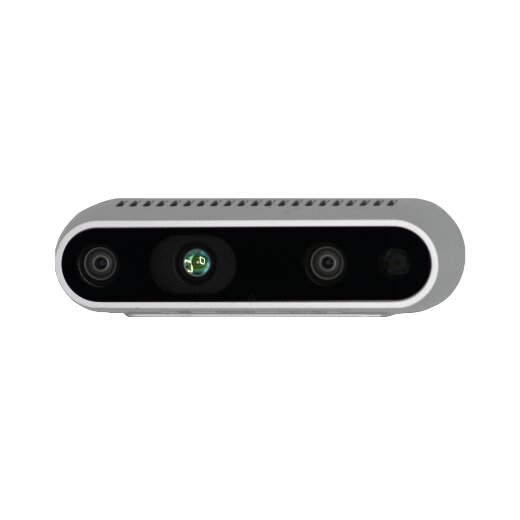
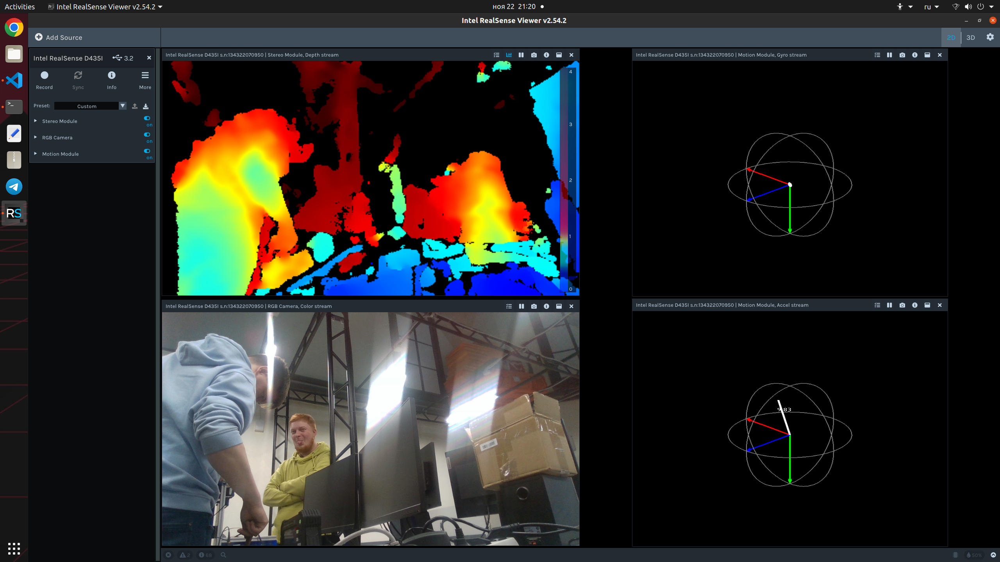
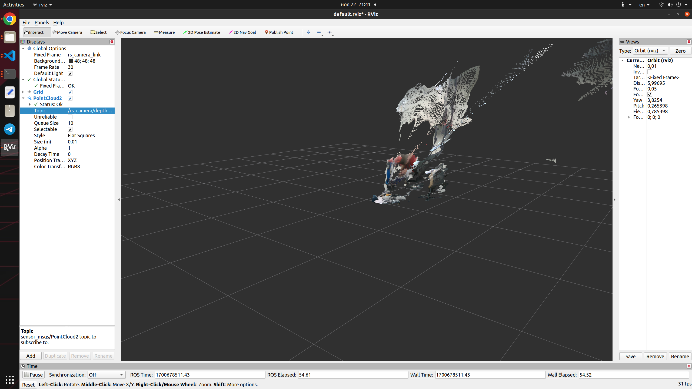
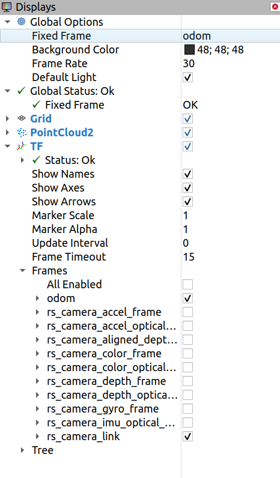

<!-- omit from toc --> 
# Визуальная одометрия

- [Зачем нужна одометрия?](#зачем-нужна-одометрия)
- [Что такое визуальная одометрия?](#что-такое-визуальная-одометрия)
- [Intel RealSense D435i](#intel-realsense-d435i)
- [Время одометри!](#время-одометри)

## Зачем нужна одометрия?

Если посмотреть [инфу о фреймах в стандарте](https://www.ros.org/reps/rep-0105.html#coordinate-frames), то можно заметить три основные фрейма, которые выделяют относительно движущихся роботов: `base_link`, `odom`, `map`.

- `base_link` часто ставят вместе с `base_footprint` за единственной разницей, что `base_link` находится где-то в центре робота, а `base_footprint` - на уровне Z=0 (на уровне земли). То есть, `base_{link/footprint}` - это фрейм, привязанный к движущемуся роботу.

- `odom` - интересующий нас фрейм, он показывает положение в пространстве, относительно которого робот движется.

- `map` - фрейм, который привязан к фиксированной точке в пространстве, относительно которой движентся робот.

> Все определения фреймов даны в собственной интерпретации и не претендуют на полноту.

Так, а не кажется тебе, что `odom` и `map` уж очень похожи? По сути так, но у них есть одно маленькое различие. `odom` фрейм - это определённая точка в пространстве, относительно которой показывает движение наша **система одометрии в роботе**.

Отличительной особенностью `map` является то, что этот фрейм более стабилен и относительно него TF формируется не только системой одометрии, но и системам позиционирования (типа кортографирование, коррекция по карте и т.д.).

Так, кажется, это сложно, простой пример!

Вот есть вафелька и у неё есть два колеса. Мы начинаем движение и говорим ей ехать 20 секунд. Теперь, вафелька проехала какое-то расстояние, так? Но как узнать, какое?

У нас есть три источника данных: рулетка, оценка перемещения по построенной карте и визуальная одометрия.

Ну, думаю, понятно, что мы делаем автономных/телеуправляемых роботов, а значит с **рулеткой** не побегать - это вариант отпадает, так как не применим в ходе работы робота.

## Что такое визуальная одометрия?

Визуальная одометрия – это надежный метод, позволяющий транспортному
средству устойчиво локализовать себя в пространстве, используя данные о смещения ключевых точек, информация о которых получается из анализа последовательности изображений системы технического зрения.

## Intel RealSense D435i

[Intel RealSense D435i](https://www.intelrealsense.com/depth-camera-d435i/) - стереокамера, которая в компактном корпусе скрывает несколько сложных датчиков, обеспечивающих обработку рабочей сцены и подготовку выходного изображения в трехмерном формате. Устройство способно определять глубину сцены и фиксировать такие движения объектов, как жесты, повороты, перемещения и их положение в ограниченном и открытом пространстве (система шести степеней свободы — 6DoF). Скорости обработки данных хватает для использования камеры в робототехнике, в летательных аппаратах, создании компьютерной графики и в платформах виртуальной реальности.

<p align="center">

</p>

За сбор и обработку изображения отвечают 3 сенсора, составляющие инерционный измерительный блок (IMU):

- инфракрасный проектор;
- 3D-сканер, подающий на выход объемную сцену в разрешении 1280 × 720 пикселей и с частотой видеоряда до 90 кадров в секунду. Рабочая дистанция сенсора — от 0.1 метра до 10 м, но максимальная дальность зависит от настроек устройства, типа сцены и условий освещения.
- RGB-сенсор, подающий на выход изображение в разрешении Full HD (1920 × 1080 пикселей) и с фиксированной частотой 30 кадров в секунду.

Давайте запустим нашу камеру и посмотрим, какие данные она может нам предложить:

```bash
realsense-viewer
```
<p align="center">

</p>

По этой команде происходит запуск `Intel RealSense SDK 2.0`, с помощью которого мы можем получить быстрый доступ к камере глубины Intel RealSense для просмотра потока глубины, визуализации облаков точек, записи и воспроизведения потоков, настройки параметров камеры и многого другого .

Посмотрели? Отлично, но для нашей работы этого недостаточно. Сейчас нужно скопировать из папки `drivers` в этом репозитории launch файл драйвера, необходимого для запуска камеры через ROS (он слишком большой и мы решили не выносить его полностью в топик). Сохраняем мы его в `kitty_vision->drivers` под названием `driver_realsense.launch`. Но этого нам недостаточно и нужно создать launch в `kitty_vision->drivers` - `start_rs_camera.launch`

```bash
<?xml version="1.0"?>
<launch>
  <group ns="rs_camera">
    <include file="$(find kitty_vision)/launch/driver_realsense.launch">
      <arg name="tf_prefix" value="rs_camera" />
      <arg name="align_depth" value="true" /> 
      <arg name="linear_accel_cov" value="0.01" />
      <arg name="unite_imu_method" value="copy" />
      <arg name="depth_fps" value="30" />
      <arg name="color_fps" value="30" />
      <arg name="enable_gyro" value="true" />
      <arg name="enable_accel" value="true" />
      <arg name="initial_reset" default="false" />
    </include>

    <node pkg="nodelet" type="nodelet" name="rgbd_sync" args="load rtabmap_sync/rgbd_sync realsense2_camera_manager" output="screen">
        <remap from="rgb/image" to="color/image_raw" />
        <remap from="depth/image" to="aligned_depth_to_color/image_raw" />
        <remap from="rgb/camera_info" to="color/camera_info" />
        <param name="approx_sync" value="false" />
      </node>
  </group>
</launch>
```

Настроим окно `Rviz`, изменив `Fixed Frame` на `rs_camera_link` и добавим `PointCloud2`

<p align="center">

</p>

>🦾	Не забудьте сохранить настройку в папку `kitty_vision->rviz` под названием `view_realsense.rviz` и добавьте в ваш файл `start_rs_camera.launch` запуск `rviz` уже с готовым конфигом.

## Время одометри!

Для того, чтобы получать значения одометрии нам нужно создать launch `rgbd_odom.launch` и поместить его в `kitty_vision->drivers`. 

```xml
<?xml version="1.0"?>
<launch>

    <arg name="camera_name" default="rs_camera" />
    <arg name="publish_tf" default="true" />

    <node pkg="rtabmap_odom" type="rgbd_odometry" name="rgbd_odometry" output="screen">
        <param name="subscribe_rgbd" type="bool" value="true" />

        <param name="frame_id" type="string" value="rs_camera_link" /> <!--base_footprint-->
        <param name="odom_frame_id" type="string" value="odom"/>

        <param name="publish_tf" type="bool" value="$(arg publish_tf)" />
        <param name="publish_null_when_lost" type="bool" value="true" />

        <param name="Reg/Force3DoF" type="bool" value="true" />
        <param name="Odom/ResetCountdown" type="string" value="1" />
        <param name="Odom/Strategy" type="string" value="0"/> <!-- 0=Frame-to-Map, 1=Frame=to=Frame -->
        <param name="OdomF2M/MaxSize" type="string" value="1000"/>
        <!-- <param name="Odom/GuessMotion" type="string" value="true"/> -->
        <param name="Vis/EstimationType" type="string" value="1"/> <!-- 0=3D->3D 1=3D->2D (PnP) -->
        <param name="Vis/MaxDepth" type="string" value="0"/>
        <param name="Vis/MinInliers" type="string" value="10"/>
        <param name="GFTT/MinDistance" type="string" value="10"/>
        <param name="GFTT/QualityLevel" type="string" value="0.00001"/>
        <param name="GFTT/QualityLevel" type="string" value="0.00001"/>

        <!-- inputs -->
        <!-- if subscribe_rgbd=false -->
        <remap from="rgb/image" to="$(arg camera_name)/color/image_raw" />
        <remap from="rgb/camera_info" to="$(arg camera_name)/color/camera_info" />
        <remap from="depth/image" to="$(arg camera_name)/aligned_depth_to_color/image_raw" />
        <!-- if subscribe_rgbd=true -->
        <remap from="rgbd_image" to="$(arg camera_name)/rgbd_image" />
        <!-- outputs -->
        <remap from="odom" to="visual_odometry" />

    </node>

</launch>
```

Запускаем наши два лаунча:

```bash
roslaunch kitty_package start_rs_camera.launch
```
```bash
roslaunch kitty_package rgbd_odom.launch
```

Чтобы визуализировать данные, то нужно донастроить `rviz` следующим образом:

<p align="center">

</p>

Если вы все сделали правильно, то у вас должно получиться нечто такое: 

<p align="center">

</p>

>🦾	Объедините лаунчи `rgbd_odom.launch` и  `start_rs_camera.launch` в один и проверьте, что все корректно запускается. Новый файл поместите в `kitty_vision->full` и назовите его, как `full_rs_odom.launch`