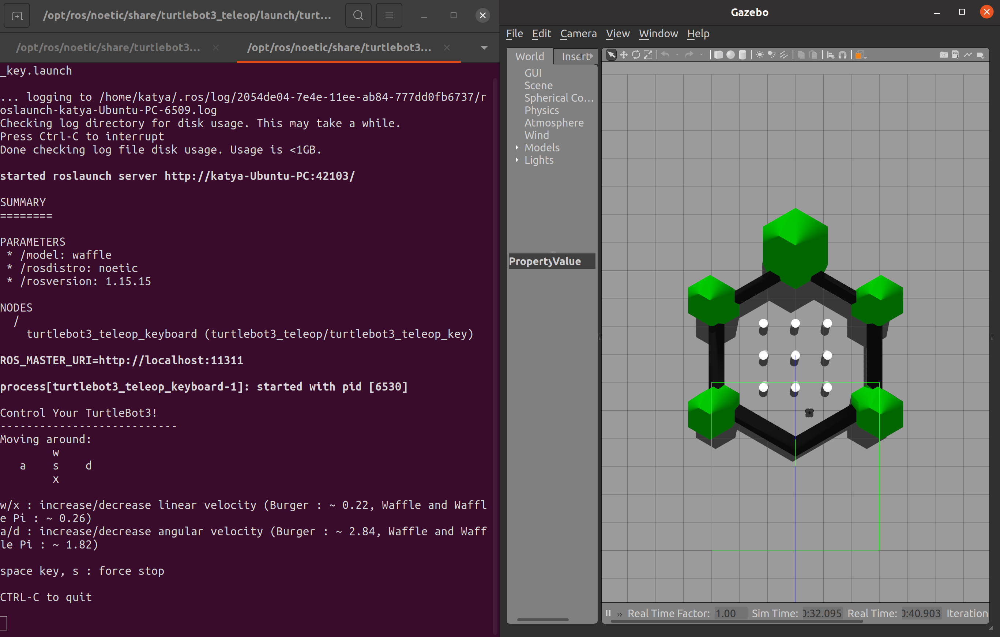
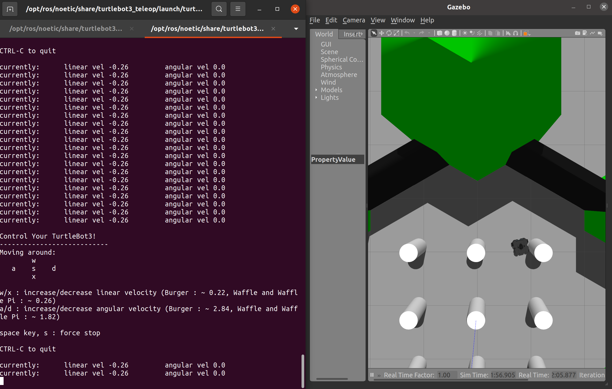
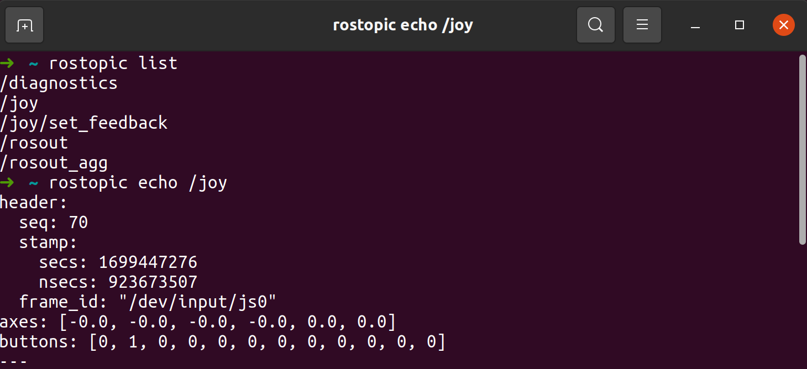

<!-- omit from toc -->
# Начало работы в ROS
- [Что мы видим?](#что-мы-видим)
- [Время двигаться!](#время-двигаться)


## Подготовка

Для работы с камерой и джойстиком необходимо установить следующее пакеты:

```bash
sudo apt install \
    ros-noetic-usb-cam\
    ros-noetic-joy
```

## Что мы видим?

На наших роботах установлены вот такие вот камеры:

<p align="center">

</p>

Сейчас мы предлагаем вам разобраться, как с ними работать и какую информацию от них мы можем извлечь. В ROS уже существует пакет, который предназначен для работы с веб-камерами и называется он `usb_cam`. 

Давайте перейдем в пакет нашей камеры и посмотрим, что в нем лежит. Для этого используем команду:

```bash
roscd usb_cam
```
В терминале делаем команду `ls` и видим, что у нас в пакете уже есть папка `launch`, давайте с ними познакомимся, для этого делаем команду `code .`. Вуаля,у нас открылось окно `VSCode`, там есть один `launch`, давайте на него подробнее взглянем:

```xml
<launch>
  <node name="usb_cam" pkg="usb_cam" type="usb_cam_node" output="screen" >
    <param name="video_device" value="/dev/video0" />
    <param name="image_width" value="640" />
    <param name="image_height" value="480" />
    <param name="pixel_format" value="yuyv" />
    <param name="color_format" value="yuv422p" />
    <param name="camera_frame_id" value="usb_cam" />
    <param name="io_method" value="mmap"/>
  </node>
  <node name="image_view" pkg="image_view" type="image_view" respawn="false" output="screen">
    <remap from="image" to="/usb_cam/image_raw"/>
    <param name="autosize" value="true" />
  </node>
</launch>
```

Давайте внутри нашего пакета в папке ```launch``` создадим папку ```drivers``` и скопируем туда этот launch, например, под названием ```start_usb_cam.launch``` и попробуем его запустить, а для этого:

```
roslaunch super_robot_package start_usb_cam.launch
```

Если у вас вышла ошибка, и камера не запустилась, то ничего страшного, возможно дело в том, что мы пытаемся открыть в `launch` не существующую камеру, нам нужно проверить какое значение `/dev/video` имеет наше камера. Для этого в терминале нам нужно выполнить

```bash
ls /dev/video*
```
И так, мы сможем увидеть, какой номер камеры мы должны использовать

Файл состоит из двух узлов (`node`):

Узел `usb_cam`:

Использует пакет `usb_cam`.

Запускается с параметрами:
- `video_device: /dev/video0`
- `image_width: 640`
- `image_height: 480`
- `pixel_format: yuyv`
- `color_format: yuv422p`
- `camera_frame_id: usb_cam`
- `io_method: mmap`
Узел `image_view`:

Использует пакет `image_view`.
- Параметр `autosize` имеет значение `true`.
- Ремаппинг `image` с `/usb_cam/image_raw`.
Файл используется для запуска узла `usb_cam`, который позволяет управлять USB-камерой, и узла `image_view`, который используется для отображения изображений, полученных от камеры.

Поехали дальше. На [страничке ROS пакета нашей камеры](http://wiki.ros.org/usb_cam) мы можем найти информацию о том, какие `topic`,`node`  и сообщения есть у нашей камеры. 
Давайте введем команду `rostopic list` и посмотрим, что у нас есть:

<p align="center">

</p>

Давайте послушаем топик `/usb_cam/image_raw`    

<p align="center">

</p>

Видим огромное количество каких-то чисел, как вы думаете, что они означают?

## Время двигаться!

```bash
TURTLEBOT3_MODEL=waffle roslaunch turtlebot3_gazebo turtlebot3_world.launch
```

```bash
TURTLEBOT3_MODEL=waffle roslaunch turtlebot3_teleop turtlebot3_teleop_key.launch
```

<p align="center">

</p>

<p align="center">

</p>

Беспроводный геймпад Logitech F710 – это универсальный и популярный геймпад, предназначенный для использования как с ПК, так и с устройствами на платформе Android. Он предлагает беспроводное подключение и ряд функций.

<p align="center">

</p>

**Таблица индексных номеров /joy.buttons**

| Индекс | Название кнопки на фактическом контроллере |
| ------ | ------------------------------------------- |
| 0      | X                                           |
| 1      | A                                           |
| 2      | B                                           |
| 3      | Y                                           |
| 4      | LB                                          |
| 5      | RB                                          |
| 6      | LT                                          |
| 7      | RT                                          |
| 8      | Back                                       |
| 9      | Start                                      |
| 10     | Кнопка стика слева                        |
| 11     | Кнопка стика справа                       |

**Таблица индексов осей /joy.axes:**

| Индекс | Название оси на фактическом контроллере |
| ------ | ----------------------------------------- |
| 0      | Ось влево/вправо стика слева             |
| 1      | Ось вверх/вниз стика слева               |
| 2      | Ось влево/вправо стика справа            |
| 3      | Ось вверх/вниз стика справа              |
| 4      | Крестовина влево/вправо                  |
| 5      | Крестовина вверх/вниз                   |

Перейдем к запуску нашего джойстика. Давайте создадим launch файл, к примеру, ```my_joy_launch.launch``` и вставим следующее содержимое

```xml
<launch>
    <node name="joy_node" pkg="joy" type="joy_node" output="screen">
        <param name="dev" value="/dev/input/js0" />
    </node>
</launch>
```
Запустим его:

```bash
roslaunch super_robot_package my_joy_launch.launch
```

<p align="center">

</p>

Теперь перейдем к управлению роботом! Для этого помимо драйвера нужно запустить файл отправки команд на робота. Для этого создайте в своём пакете папку config и добавьте туда файл joy.config.yaml со следующим содержанием:

```yaml
axis_linear: 1  # Left thumb stick vertical
scale_linear: 0.7
scale_linear_turbo: 1.5

axis_angular: 0  # Left thumb stick horizontal
scale_angular: 0.4

enable_button: 2  # Left trigger button
enable_turbo_button: 5  # Right trigger button
```

 Модернизируем предыдущий лаунч следующим способом: 

```xml
<launch>
  <arg name="joy_dev" default="/dev/input/js0" />
  <arg name="config_filepath" default="$(find super_robot_package)/config/joy.config.yaml" />
  
  <node pkg="joy" type="joy_node" name="joy_node">
    <param name="dev" value="$(arg joy_dev)" />
    <param name="deadzone" value="0.3" />
    <param name="autorepeat_rate" value="20" />
  </node>

  <node pkg="teleop_twist_joy" name="teleop_twist_joy" type="teleop_node">
    <rosparam command="load" file="$(arg config_filepath)" />
  </node>
</launch>
```
Запустим робота и управление с джойстика
```bash
TURTLEBOT3_MODEL=waffle roslaunch turtlebot3_gazebo turtlebot3_world.launch
```

```bash
roslaunch super_robot_package my_joy_launch.launch
```
Для движения нашего робота нужно держать кнопку `X` или если мы хотим прокатиться в турбо режиме - `RB`

<p align="center">

</p>

Задание:
- Измените конфиг так, чтобы робот начал двигаться быстрее.
- Посмотрите в каком формате присылает данные узел `teleop_twist_joy`. За что отвечает каждое поле?
